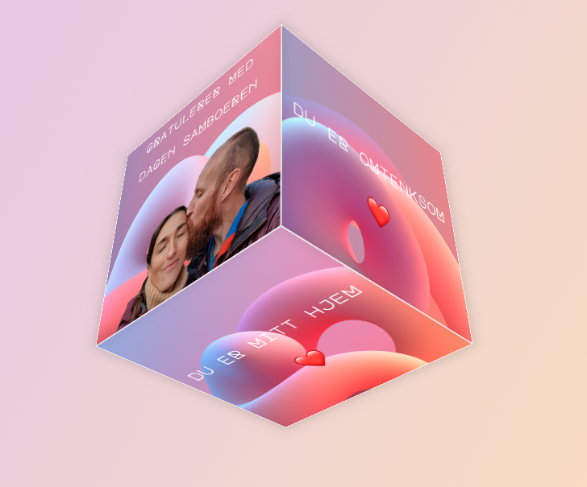

# Birthday Cube 🎁


A simple interactive 3D cube display with personalized birthday messages that rotates and  responds to user input. Happy 3D birthday Viktor! 🎉

## Features ✨

- Auto-rotating 3D cube with messages on each face
- Interactive controls:
  - Click to pause/resume rotation
  - Mouse/touch drag for manual rotation
  - Arrow key controls
- Responsive design for mobile and desktop
- Smooth animations and transitions
- Custom gradient backgrounds
- Animated heart emojis
- Welcome instructions modal

## Tech Stack 🛠

- HTML5 (3D transforms)
- CSS3
  - Flexbox
  - CSS Animations
  - CSS Transforms
  - Media Queries
  - Google Fonts (Major Mono Display)
- Vanilla JavaScript
  - RequestAnimationFrame API
  - Touch Events
  - Mouse Events
  - Keyboard Events

## Installation 💻

1. Clone the repository:
```
git clone https://github.com/torildhov/birthday-cube.git
```

2. Navigate to project directory:
```
cd birthday-cube
```

3. Open index.html in browser or use local server:
- Open index.html in browser from your file system
- Or use local server like Live Server in VS Code

## Usage 🎮
### Desktop:
- Click cube to pause/resume rotation
- Move mouse while paused to rotate manually
- Use arrow keys for precise rotation control

### Mobile:
- Tap to pause/resume rotation
- Touch and drag to rotate manually

## Project structure 📁
```
birthday-cube/
├── index.html
├── styles.css
├── script.js
└── assets/
    ├── dddepth-316.jpg
    ├── dddepth-317.jpg
    ├── dddepth-318.jpg
    ├── dddepth-319.jpg
    ├── dddepth-320.jpg
    ├── dddepth-321.jpg
    ├── pic1.png
    └── birthday-cube.png
```

## Browser Support 🌐
Works best in modern browsers that support:

- CSS 3D Transforms
- RequestAnimationFrame
- Touch Events
- ES6+ JavaScript

